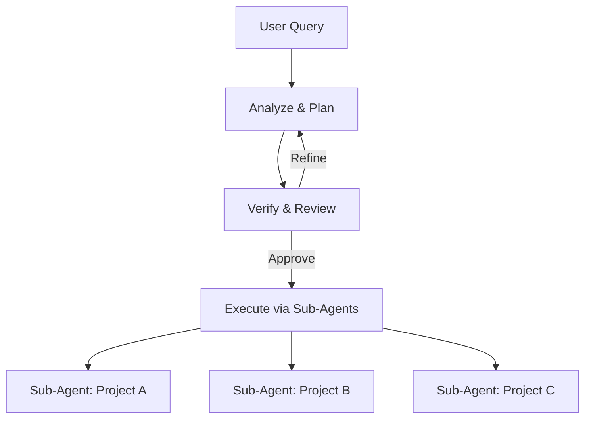

<div align="center">

# Sutra Knowledge CLI

[![Python version][python_version_img]][python_dev_url]
[![Python report][python_report_img]][python_report_url]
[![Code coverage][python_code_coverage_img]][repo_url]
[![License][repo_license_img]][repo_license_url]

An **intelligent codebase analysis** and **knowledge management tool** that provides **AI-powered insights**, **semantic search capabilities**, and **comprehensive project understanding** through advanced parsing and embedding technologies. Focus on **writing your code** and **thinking of the business-logic**! The CLI will take care of the rest.

</div>

## ⚡️ Quick Start

First, [download][python_download_url] and install **Python**. Version `3.11` or
higher is required.

Installation is done by using the [`pip install`][python_install_url] command:

```bash
pip install sutrakit
```

### Setup environment

Sets up `~/.sutra` directory, downloads ML models, creates config files, sets environment variables, and prepares BAML client for AI code analysis.

```bash
sutrakit-setup
```


That's all you need to know to start! 🎉

### Indexing Your Projects

To enable analysis, each project must be indexed. This process parses the codebase, extracts structures, and builds embeddings for semantic search.

1. Navigate to your project directory (e.g., `cd my-project`).
2. Run `sutrakit` – if the project isn't indexed, you'll be prompted to do so.
   - Confirm indexing when asked; it typically takes a few minutes depending on project size.

For ecosystems with multiple related projects (e.g., backend, frontend, microservices):

- Repeat the above in each project's directory.
- Sutrakit automatically links them by matching connections, creating a dependency graph for ecosystem-wide analysis.


**Important Note:**

- For the Roadmap Agent to fully discover and navigate inter-project connections (e.g., API calls, message queues, WebSockets), **cross-indexing** is required during the indexing phase. This builds a dependency graph of external links that standard parsing might miss. Without it, the agent can't trace code flows across projects, resulting in incomplete roadmaps.
- Do not run cross-indexing parallelly for multiple projects, as it can lead to conflicts and incomplete or incorrect dependency graphs.

**Supported Languages and Parsing:**

Sutrakit uses [Tree-sitter](https://tree-sitter.github.io/tree-sitter/) for advanced AST-based parsing to extract code blocks such as functions, classes, methods, etc. Currently, this is fully supported only for Python, TypeScript, and JavaScript, where custom extractors have been implemented for precise structure extraction and embedding. For other languages, the tool falls back to default file-based indexing, where individual code blocks are not extracted—instead, embeddings are generated based on chunks of a certain word length. As a result, the quality of semantic search, analysis, and insights may vary for unsupported languages.

## 📝 Key Features

Sutrakit is an orchestrator for AI agents and services, focused on multi-project codebase analysis and management. It helps developers handle complex ecosystems by providing intelligent insights and automated workflows. Below are the core features, with a diagram for the key component.

- **AI-Powered Roadmap Agent**:

  - Processes user queries to create minimal plans across projects.
  - Identifies change locations, reuses code, and defines integrations.
  - Refines via feedback; orchestrates sub-agents for execution.

- **Orchestration of Sub-Agents**:

  - Spawns AI sub-agents for parallel project updates.
  - Handles dependencies seamlessly.
  - Note: Before spawning sub-agents, set up and authenticate **rovodev** or **gemini CLI** tools (currently supported providers). Install them via their respective docs (e.g., pip install rovodev or Google Cloud SDK for Gemini) and ensure auth (API keys, tokens) is configured to avoid runtime issues.

- **Cross-Indexing Service**:

  - Discovers and indexes external connections (e.g., APIs, message queues, WebSockets) beyond standard parsing, using advanced matching for identifiers, parameters, wrappers, and variables.
  - Builds a dependency graph by scanning new projects against existing ones, creating links for matched connections to enable seamless navigation and hopping between projects during analysis.

- **Semantic Search and Code Analysis**:

  - Queries codebases with semantic/keyword tools.
  - Manages memory to optimize operations.

### Roadmap Agent Workflow



## Use Cases

Sutrakit excels in interconnected projects like microservices or full-stack apps:

- **New Feature**: Maps backend-to-frontend changes; generates contracts; updates via sub-agents.
- **Bug Fix**: Traces dependencies; plans minimal fixes.
- **Refactor**: Analyzes patterns; roadmaps reusable updates.
- **Onboard Repo**: Indexes and links to ecosystem for integrations.

This keeps focus on practical value to see if it fits your needs.

## Configuration

Sutrakit allows customization through the system configuration file located at `~/.sutra/config/system.config`. This JSON file controls various aspects of the tool, such as database paths, storage directories, embedding models, logging, and LLM providers. You can edit it manually to tweak settings—changes take effect on the next run. Always back up the file before modifying, and ensure valid JSON format to avoid errors.

Here's a partial view of the config file (focusing on the LLM section for brevity; other sections like database and storage are omitted):

```json
{
  ...
  "llm": {
    "provider": "aws_bedrock|anthropic|google_ai|vertex_ai|azure_openai|openai|azure_aifoundry|openrouter",
    "aws_bedrock": {
      "access_key_id": "YOUR_ACCESS_KEY",
      "secret_access_key": "YOUR_SECRET_KEY",
      "region": "us-east-2",
      "model_id": "us.anthropic.claude-sonnet-4-20250514-v1:0",
      "max_tokens": "OUTPUT_TOKENS"
    },
    "anthropic": {
      "api_key": "YOUR_API_KEY",
      "model_id": "us.anthropic.claude-sonnet-4-20250514-v1:0",
      "max_tokens": "OUTPUT_TOKENS"
    },
    "google_ai": {
      "api_key": "YOUR_API_KEY",
      "model_id": "gemini-2.5-pro",
      "base_url": "https://generativelanguage.googleapis.com/v1beta",
      "max_tokens": "OUTPUT_TOKENS"
    },
    "vertex_ai": {
      "location": "global",
      "model_id": "gemini-1.5-flash",
      "max_tokens": "OUTPUT_TOKENS"
    },
    "azure_openai": {
      "api_key": "YOUR_API_KEY",
      "base_url": "https://your-resource-name.openai.azure.com/openai/deployments/your-deployment-id",
      "api_version": "2025-01-01-preview",
      "max_tokens": "OUTPUT_TOKENS"
    },
    "openai": {
      "api_key": "YOUR_API_KEY",
      "model_id": "gpt-4.1",
      "max_tokens": "OUTPUT_TOKENS"
    },
    "azure_aifoundry": {
      "api_key": "YOUR_API_KEY",
      "base_url": "https://RESOURCE_NAME.REGION.models.ai.azure.com",
      "max_tokens": "OUTPUT_TOKENS"
    },
    "openrouter": {
      "api_key": "YOUR_API_KEY",
      "model_id": "openai/gpt-3.5-turbo",
      "max_tokens": "OUTPUT_TOKENS",
      "http_referer": "YOUR-SITE-URL", //Optional
      "x_title": "YOUR-TITLE" //Optional
    }
  }
  ...
}
```

### Example: Changing the LLM Provider

The `"llm"` section lets you switch AI providers (e.g., for the Roadmap Agent) and configure credentials. By default, it's set to `"aws_bedrocks"`. To change it:

1. Update `"provider"` to one of: `"aws_bedrock"`, `"anthropic"`, `"google_ai"`, `"vertex_ai"`, `"azure_openai"`, `"openai"`, `"azure_aifoundry"`, or `"openrouter"`.
2. Fill in the corresponding subsection with your API keys or credentials (leave others blank if unused).
3. Optionally, adjust model IDs for specific LLMs.

**Switch to Anthropic Example:**

```json
"llm": {
  "provider": "anthropic",
  "aws_bedrock": { /* Leave as-is or blank */ },
  "anthropic": {
    "api_key": "YOUR_API_KEY",
    "model_id": "claude-4-sonnet-20250514",
    "max_tokens": "OUTPUT_TOKENS"
  },
  "google_ai": { /* Leave as-is or blank */ },
  "vertex_ai": { /* Leave as-is or blank */ },
  "azure_openai": { /* Leave as-is or blank */ },
  "openai": { /* Leave as-is or blank */ },
  "azure_aifoundry": { /* Leave as-is or blank */ },
  "openrouter": { /* Leave as-is or blank */ }
}
```

After saving, restart Sutrakit to apply changes. For other sections (e.g., logging level or embedding model), edit values directly—refer to the file for details.

### Common Maximum Output Token Limits

Here are typical `max_tokens` values for popular models (as of early 2025):

- **GPT-5**: 128,000 tokens
- **GPT-4.1**: 32,000 tokens
- **Claude Sonnet 4**: 64,000 tokens  
- **Gemini 2.5 Pro**: 64,000 tokens

**Note**: The `max_tokens` parameter controls the maximum number of tokens in the model's output response, not the input context window. Always check your model's documentation for the exact output token limit, as these values may change with model updates.

## 🛠️ Development Setup

If you want to contribute to the project or modify the BAML configurations, follow these steps:

### Prerequisites

- Python 3.11+
- Git
- pip

### Quick Setup

1. **Clone the repository:**

   ```bash
   git clone https://github.com/sutragraph/sutracli.git
   cd sutracli
   ```

2. **Run the development setup script:**
   ```bash
   ./scripts/setup-dev.sh
   ```

This script will:

- Install development dependencies (including pre-commit)
- Set up pre-commit hooks
- Test BAML client generation
- Run initial code quality checks

### Manual Setup

If you prefer to set up manually:

1. **Install development dependencies:**

   ```bash
   pip install -e ".[dev]"
   ```

2. **Install pre-commit hooks:**

   ```bash
   pre-commit install
   ```

3. **Generate BAML client (if needed):**
   ```bash
   ./scripts/generate-baml.sh
   ```

4. **Run Setup:**

   ```bash
   sutrakit-setup
   ```

### Pre-commit Hooks

The project uses pre-commit hooks to ensure code quality and keep BAML client files up-to-date:

- **BAML Generation**: Automatically regenerates BAML client files when `baml_src/` files change
- **Code Formatting**: Runs Black and isort on Python files
- **Code Quality**: Checks for trailing whitespace, large files, merge conflicts, etc.
- **File Validation**: Validates YAML, JSON, and TOML files

### Working with BAML

When you modify files in `baml_src/`, the pre-commit hooks will automatically:

1. Regenerate the BAML client files in `baml_client/`
2. Add the updated client files to your commit
3. Ensure code formatting and quality standards

You can also manually regenerate BAML client files:

```bash
./scripts/generate-baml.sh
```

### Running Tests

```bash
# Run all pre-commit hooks
pre-commit run --all-files

# Run specific hook
pre-commit run baml-generate
```

## ⭐️ Project assistance

If you want to say **thank you** or/and support active development of
`Sutra Knowledge CLI`:

- Add a [GitHub Star][repo_url] to the project.
- Write interesting articles about project on [Dev.to][dev_to_url], or
  personal blog.

## 🏆 A win-win cooperation

And now, I invite you to participate in this project! Let's work **together** to
create the **most useful** tool for developers on the web today.

- [Issues][repo_issues_url]: ask questions and submit your features.
- [Pull requests][repo_pull_request_url]: send your improvements to the current.

Together, we can make this project **better** every day! 😘

<!-- Python -->

[python_download_url]: https://www.python.org/downloads/
[python_install_url]: https://pip.pypa.io/en/stable/installation/
[python_version_img]: https://img.shields.io/badge/Python-3.11%2B-3776AB?style=for-the-badge&logo=python
[python_report_img]: https://img.shields.io/badge/Python_report-A%2B-success?style=for-the-badge&logo=none
[python_report_url]: https://github.com/sutragraph/sutracli
[python_code_coverage_img]: https://img.shields.io/badge/code_coverage-90%25-success?style=for-the-badge&logo=none

<!-- Repository -->

[repo_url]: https://github.com/sutragraph/sutracli

[repo_logo_url]: [url_placeholder]
[repo_logo_img]: https://www.svgrepo.com/download/421259/ai-brain-data.svg
[repo_license_url]: https://github.com/sutragraph/sutracli/blob/main/LICENSE
[repo_license_img]: https://img.shields.io/badge/license-GPL-red?style=for-the-badge&logo=none
[repo_cc_url]: https://creativecommons.org/licenses/by-sa/4.0/
[repo_issues_url]: https://github.com/sutragraph/sutracli/issues
[repo_pull_request_url]: https://github.com/sutragraph/sutracli/pulls
[repo_discussions_url]: https://github.com/sutragraph/sutracli/discussions
[repo_releases_url]: https://github.com/sutragraph/sutracli/releases
[repo_wiki_url]: https://github.com/sutragraph/sutracli/wiki
[repo_wiki_img]: https://img.shields.io/badge/docs-wiki_page-blue?style=for-the-badge&logo=none
[repo_wiki_faq_url]: https://github.com/sutragraph/sutracli/wiki/FAQ

<!-- Project -->

[sutrakit_product-hunt_url]: [url_placeholder]

<!-- Author -->

[author]: https://github.com/sutragraph

<!-- Readme links -->

[dev_to_url]: https://dev.to
[sqlite_url]: https://sqlite.org
[faiss_url]: https://github.com/facebookresearch/faiss
[anthropic_url]: https://anthropic.com
[openai_url]: https://openai.com
[gcp_url]: https://cloud.google.com/vertex-ai
[brew_url]: https://brew.sh

[boosty_url]: [url_placeholder]
[python_dev_url]: https://www.python.org/
