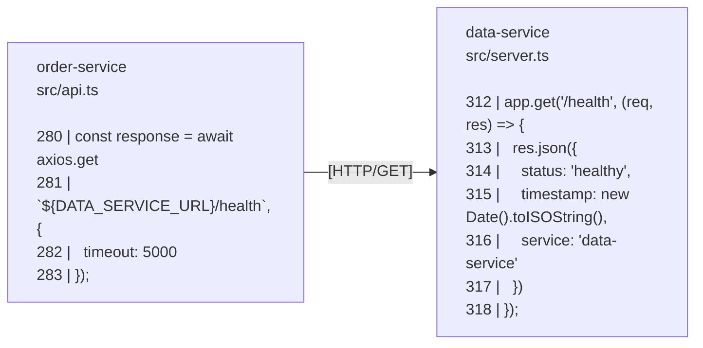

# From Manual Tracing to Instant Roadmaps: Unlocking Microservices Flows with SutraCLI

Hey there, if you've ever found yourself buried in a web of microservices repos, trying to map out how one piece connects to another just to grasp a basic flow like order creation through to fulfillment, you're in good company. We've all been elbow-deep in that—separate codebases, manually flipping between files to trace API calls and message queues. It gets the job done... eventually, but it's a grind, eating up way too much time on what should be straightforward insights. This is a staple pain point in distributed systems, popping up in everything from e-commerce setups to scalable cloud architectures. As devs always on the lookout for smarter workflows, the question arises: How can we automate this cross-repo tracing with AI? Enter SutraCLI—it cuts flow-mapping time from minutes of tedium to seconds of clarity. But the old manual method is painfully slow. In this post, we'll break down why that approach drags and how SutraCLI turbocharges efficiency, zooming in on its standout feature: cross-indexing.

To illustrate the concepts, we'll reference a simple GitHub demo repo with three microservices: github.com/example-user/microservices-demo. Feel free to clone it and follow along, but we'll keep the focus here on the high-level pains and how SutraCLI solves them without diving deep into the repo's code.

## The Naive Approach

The initial tactic is dead simple and hands-on: Open up each repo in your editor, search for key terms like API endpoints or queue names, and manually sketch out the connections. For our demo repo with three services, you'd trace how one publishes events, another consumes them, and APIs tie it all together.

![A snapshot of manual notes for the flow—already turning into a scribble fest.]

Sure, it works for a rough diagram, but the execution has a glaring issue: combing through files across repos every time. If you've wrangled complex systems before, you know this scales poorly—even for a small setup, it's a time sink, and with more repos, it spirals.

### Why It Fell Short

Relying on manual scans means effort grows with the system's size. In a small setup, it's manageable, but as repos multiply, so does the hassle. Think of it as linearly expanding work: Scanning one repo might take a minute or two, but multiple ones triple that, plus the brain drain from constant context shifts. It's not just about time—it's the inefficiency of revisiting irrelevant code and manually piecing together integrations.

### The Process in Action

Here's how it plays out at a high level:

**Manual tracing routine (in pseudo-steps):**

1. Find the entry point for the initial request and trace its logic.
2. Identify where events or messages are sent out.
3. Switch to the consuming service and follow the handling logic.
4. Track any external calls or operations triggered.
5. Check how updates propagate back through the system.
   ...and iterate for any side paths or error handling.

**The downsides are clear:**

- **Full scans every time:** No shortcuts, just exhaustive reads.
- **Wasted effort:** Skimming unrelated sections.
- **Heavy switching:** Loading repos, recalling connections by hand.
- **No smart linking:** Spot integrations yourself—no auto-magic.

**Outcome?** For a 3-repo example like our demo, tracing one flow averages 5-10 minutes. Bump to more repos? It could stretch to half an hour or more, turning quick checks into productivity black holes.

You can spot the pattern—it ramps up fast. Time for a better way.

## The Optimized Approach: SutraCLI to the Rescue

To crank up the speed, lean on SutraCLI. It indexes repos with AI smarts, weaves a unified dependency graph through cross-indexing, and lets you query flows in plain English. The payoff? Dropping trace times to near-instant, courtesy of pre-linked graphs and clever search. This directly tackles limitations in tools like Cursor and other AI code assistants, which often fixate on a single repo. They lack the broader context of how one repo connects to others—missing inter-service ties like API calls or message queues—which can lead to incomplete or erroneous insights. If they misinterpret something in one repo, it cascades to affect connected ones, requiring manual corrections. SutraCLI sidesteps this by building a holistic graph across all indexed repos, ensuring accurate, ecosystem-wide tracing without the need for constant fixes.

### Drawing from Smart Search: The Power of Cross-Indexing

Taking a cue from efficient algorithms that prep data for quick access, SutraCLI's cross-indexing is like organizing the entire ecosystem upfront for lightning-fast queries. It bridges the repos by detecting cross-repo hooks—think API endpoints, RabbitMQ publishes/consumes, or shared data models. This builds a navigable graph where queries jump straight to connections, skipping the brute force.

**Here's the nitty-gritty:**

- **Per-repo indexing:** Pulls out code structures and embeds for meaning-based search.
- **Cross-indexing magic:** Scans for matches like queue keys or API signatures across repos, forging links for seamless flow tracing.
- **End result:** Queries navigate the graph efficiently, delivering complete roadmaps without repo-hopping.

After indexing each repo one after another (to dodge any graph mix-ups), cross-indexing automatically ties together messaging pipelines and API calls.

#### How Cross-Repo Connections Are Stored

Once cross-indexing identifies connections between repos, SutraCLI stores them in a structured format for efficient querying. For instance, a mapped connection might describe: "The outgoing HTTP GET request to the path '/health' is an exact match for the incoming HTTP GET endpoint defined at the path '/health'."

To visualize this connection, here's a UML diagram linking the sender and receiver code snippets across repos:



These connections are integrated directly with the tool results so the agent never misses them, which helps it hop to the right repo while tracing.

## Putting It to Work and Seeing the Gains

To illustrate how this plays out in real time, let's look at a recent SutraCLI session on our demo repo.

### Brief Overview of the Demo Services

Our demo consists of three microservices:

- **data-service**: A Node.js/Express service handling storage via JSON files and REST endpoints.
- **inventory-service**: A Python service using RabbitMQ for stock updates.
- **order-service**: A Node.js service with event publishing and subscriptions.

The query was:

```
can you describe me the flow for order creation to order fulfillment?
```

The tool processed it smoothly, producing a detailed roadmap. Here's the result (feel free to compare it against the demo repo's code after reading through—it's a great way to verify and see the magic in action):

```
Here is the end-to-end flow for order creation to fulfillment, spanning across the three services:

### 1. Order Creation (`order-service`)
1. **API Request**: A client sends a `POST` request to the `/orders` endpoint in the `order-service` with customer and product details.
2. **Order Initialization**: The service validates the request, finds the product in its local catalog, calculates the price, and creates a new order object with a unique ID and an initial status of 'CREATED'.
3. **Data Persistence**: The `order-service` immediately persists this new order by making a `POST` HTTP call to the `/orders` endpoint of the `data-service`.
4. **Event Publishing**: After successfully saving the order, the `order-service` publishes an `order.created` message to the `orders.exchange` in RabbitMQ. This message contains the order ID, product name, and quantity.

### 2. Order Processing (`inventory-service`)
1. **Event Consumption**: The `inventory-service` is continuously listening to the `order.created` queue. When the message from the `order-service` arrives, it triggers the processing logic.
2. **Inventory Check & Reservation**: The service begins a series of HTTP calls to the `data-service` to manage inventory:
   - It first checks if the product exists and if there is enough stock available (`GET /inventory/:product` and `POST /inventory/:product/check`).
   - If stock is available, it reserves the required quantity (`POST /inventory/:product/reserve`). This prevents other orders from taking the same stock.
3. **Order Fulfillment**: Once the stock is reserved, the service fulfills the order, which atomically decrements the stock quantity and the reserved quantity (`POST /inventory/:product/fulfill`).
4. **Status Update**: After processing, the `inventory-service` publishes a new message to the `orders.exchange` with a routing key indicating the outcome (e.g., `order.status.fulfilled` or `order.status.failed`).

### 3. Data Persistence (`data-service`)
1. **Order Storage**: When it receives the `POST /orders` call from the `order-service`, the `data-service` adds the new order to its list and saves the entire list to a JSON file (`orders.json`).
2. **Inventory Management**: When it receives the inventory-related calls (`/reserve`, `/fulfill`, etc.) from the `inventory-service`, the `data-service` updates its inventory records. Each of these operations concludes by saving the updated inventory state to another JSON file (`inventory.json`), ensuring data persistence.

### 4. Final Status Update (`order-service`)
1. **Status Consumption**: The `order-service` is also subscribed to RabbitMQ, listening for messages with the routing key `order.status.*`.
2. **Order Update**: When it receives a status update message (e.g., 'fulfilled') from the `inventory-service`, it finds the corresponding order and updates its status locally. This completes the lifecycle, and the order is now marked as fulfilled in the `order-service` as well.
```

This result was generated by SutraCLI's Roadmap Agent, which iteratively used semantic search to pinpoint relevant code—starting with the order creation endpoint, then tracing event handling, and finally verifying endpoints. The process took mere seconds, navigating the cross-indexed graph to connect the dots across repos without missing critical inter-service links like RabbitMQ exchanges or API calls.

## The Demo Video

To watch it unfold, check the attached demo video: From indexing and cross-linking to querying and the polished roadmap output.

## Wrapping Up: More Than Just Speed

SutraCLI doesn't just accelerate—it's a team enabler. New folks can query flows on day one, shrinking onboarding ramps. For everyday tasks: Pinpoint bugs across boundaries, refactor with confidence, or brainstorm integrations using AI suggestions. Unlike single-repo-focused tools like Cursor, SutraCLI's cross-indexing ensures you see the full picture, reducing errors and manual rework by understanding how services interconnect.

If tangled microservices are your nemesis, SutraCLI's worth a look—swing by the SutraGraph website for more. What's your biggest tracing headache? Hit the comments!

Cheers,  
[Your Name]  
September 23, 2025
